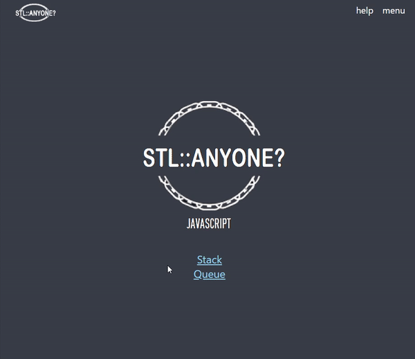

# STL::anyone? by Standard-Library-Maker
- STL(Standard Template Library) for javascript
- Naver D2 campusfest
- clone and execute by following each readme steps ('/testcode', '/web')
- test codes in the '/testcode' folder
- view on the website using '/web' folder

# Sample Web

-----
## License
- Created by) Kang Se Eung, Lee Ji Soo, Cho Young Il
- Standard-Library-Maker/STL-anyone is licensed under the [MIT license](LICENSE).
